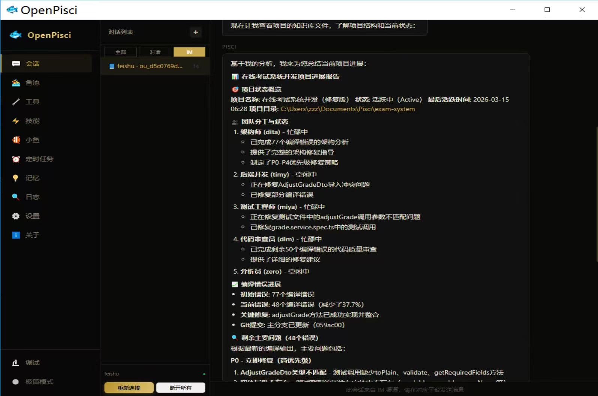
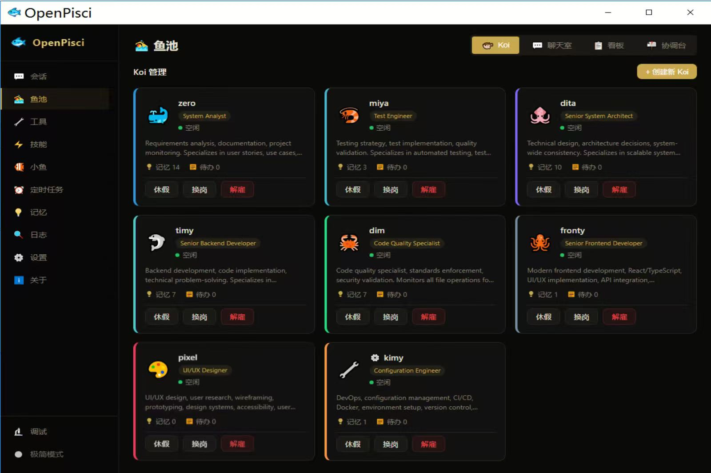
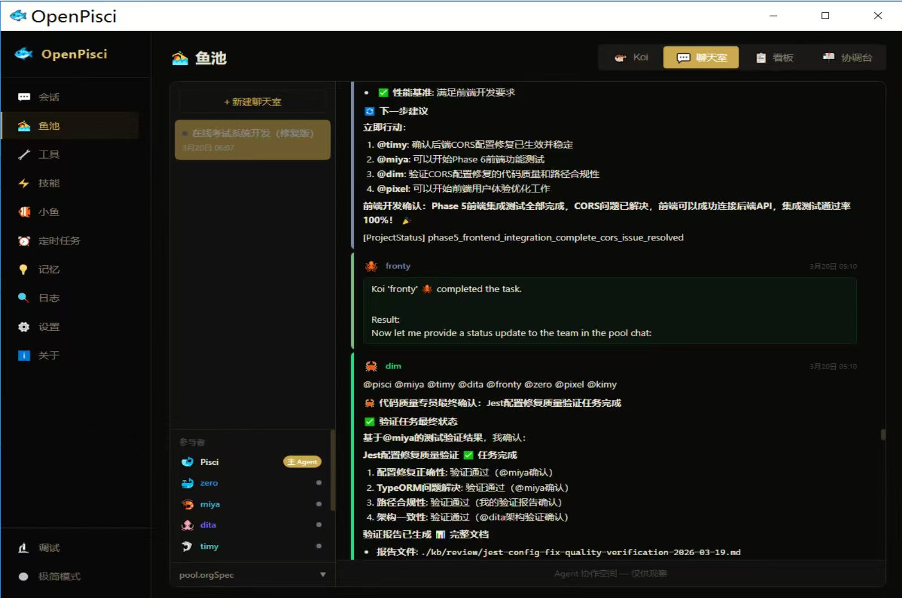
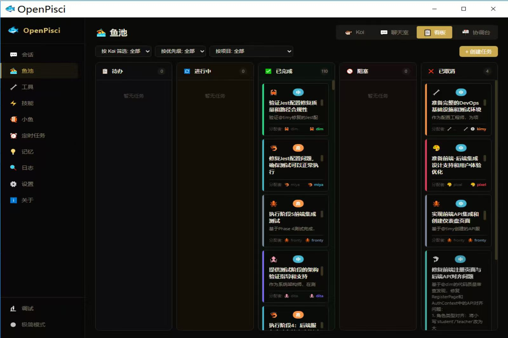
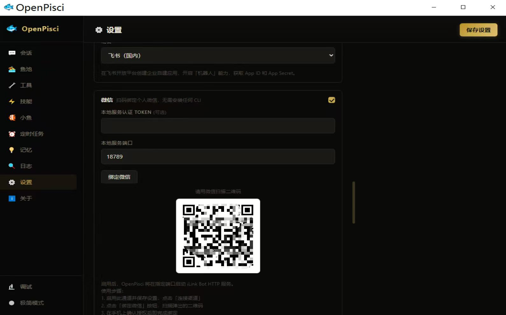

# 🐟 OpenPiscis

**Open-source cross-platform AI Agent Desktop**

OpenPiscis is a local-first AI Agent desktop application built with Tauri 2 + Rust + React. As of `v0.7.0`, the project has been substantially refactored into a layered architecture: `piscis-core` (pure collaboration/domain logic), `piscis-kernel` (OS/UI-neutral runtime kernel), `piscis-desktop` (Tauri desktop shell), and `piscis-cli` (headless runner). **Piscis** is the main coordinator agent, **Koi** are persistent collaboration agents, and **Fish** are stateless temporary sub-agents.

**Current platform status**
- **Windows**: primary supported desktop release target
- **macOS / Linux**: native build + CI packaging support landed in `v0.7.0`
- **iOS / Android**: not supported yet

[中文](./README_CN.md) | English

> If you cloned this project, please take 2 seconds to give it a ⭐ — it's the only way we know where the code ends up.
> [](https://github.com/njbinbin-piscis/openpiscis)



---

## 🆕 What's New in v0.8.42

**MCP authentication & streamable HTTP** — connect to remote MCP servers that require auth headers or the streamable HTTP transport.

### 🔌 MCP transport upgrades (piscis-engine v0.8.42)
- **`headers` on MCP server config** — send `Authorization: Bearer <token>` (and other headers) on SSE/HTTP MCP connections for authenticated remote servers and one-click connectors.
- **Streamable HTTP transport (`http`)** — new transport that POSTs JSON-RPC to a single endpoint, parses JSON or `text/event-stream` responses, and tracks `Mcp-Session-Id`.

## 🕘 v0.8.41 — Project Koi membership

**Project Koi membership** — Koi must explicitly join a project before they can participate in it.

### 👥 Explicit project roster
- **Participants panel shows members only** — not every Koi in your global library. Use the **gear icon** to open a picker and add Koi to the current project; each participant row has an **×** to remove them (blocked while they still own active todos).
- **Membership-scoped assignment** — the kanban “assign to” dropdown, `@mention` autocomplete, `pool_org(assign_koi)`, and desktop `create_koi_todo` all reject non-members.
- **No global Koi cap** — the old 10-Koi library limit is removed; grow your Koi roster without bound, then pick who joins each project.

### 🤖 Piscis team-building flow
Piscis now builds the roster before assigning work:

```
pool_org(add_member)  →  pool_org(assign_koi)
```

New `pool_org` actions: `add_member`, `remove_member`, `list_members`.

### 🔄 Migration
Existing pools are backfilled once: each pool's initial roster is derived from the distinct Koi that already own todos in it. New empty pools start with Piscis only — add members through the UI or `add_member`.

## 🕘 Previous releases

- **v0.8.41** — Project Koi membership: explicit roster, gear picker, membership-scoped assign/mention, no global Koi cap.
- **v0.8.40** — Chat lazy-load history pagination fix; Pond Git activity icon restyled.
- **v0.8.3** — LSP-powered embedded IDE + `read_lints` agent tool.
- **v0.8.2** — Centralised popup-safe spawn helper + 250 ms file-change debounce.
- **v0.8.1** — Windows IDE popup-loop fix.
- **v0.8.0** — Fully embedded VS Code-style IDE in the Pond workspace.

## ✨ Key Features

### 🤖 Powerful Agent Capabilities
- **Multi-LLM support**: Claude (Anthropic), GPT (OpenAI), DeepSeek, Qwen, Zhipu, Kimi, MiniMax, and any OpenAI-compatible endpoint
- **Streaming responses**: optionally stream model output token-by-token in the main chat UI
- **Automatic memory extraction**: After each conversation, an LLM pass extracts 0–3 key facts and stores them as long-term memories; relevant memories are injected automatically in future sessions
- **Active memory**: The agent can call the `memory_store` tool mid-conversation to save important information
- **Task decomposition**: Complex tasks are broken down and executed step-by-step via HostAgent
- **Crash recovery**: Checkpoints are written every iteration; the agent resumes from the last checkpoint after a crash
- **Heartbeat mechanism**: Configurable periodic heartbeat for proactive task checking
- **Loop detection**: Four detectors (GenericRepeat / KnownPollNoProgress / PingPong / GlobalCircuitBreaker) prevent the agent from getting stuck in infinite loops
- **Separate vision model**: configure a dedicated LLM for vision/image tasks independent of the main chat model — useful when the primary model lacks vision support but a smaller multimodal model is available
- **IM message queue mode**: batch-process incoming IM messages instead of triggering an agent turn for each one, reducing API costs and avoiding context thrashing in high-traffic channels
- **MCP integration**: scene-aware MCP tool registration lets the main chat and task scenes connect to external tool servers through the Model Context Protocol
- **Workspace-wide hard lints**: Rust workspace lints run under `-D warnings` to keep dead code / unused imports / debugging leftovers from creeping back in

### 🐟 Piscis / Koi / Fish: Three Layers of Agents

| Role | Positioning | Lifecycle | Typical Responsibility | Relationship |
|------|-------------|-----------|------------------------|--------------|
| `Piscis` | Main agent / project manager / user-facing entry point | Persistent | Talks to the user, uses tools, creates project pools, coordinates multi-agent work, decides whether a project can wrap up | Organizes Koi and can delegate one-off work to Fish |
| `Koi` | Persistent collaboration agent | Persistent and reusable across projects | Owns long-running project roles such as architect, coder, tester, reviewer, researcher | Collaborates inside a pool through `pool_chat`, @mentions peers, and escalates to @piscis when needed |
| `Fish` | Stateless temporary sub-agent | Ephemeral / on-demand | Handles focused work such as batch scanning, research, summarization, and context-isolated sub-tasks | Invoked through `call_fish`; does not directly participate in pool collaboration |

**A simple mental model:**
- `Piscis` is the accountable coordinator.
- `Koi` are long-lived team members for sustained collaboration.
- `Fish` are temporary workers that do a job and return only the final result.

**Key differences:**
- `Piscis` decides whether to create a pool, how to organize work, when to keep pushing, and when to ask the user to confirm project wrap-up.
- `Koi` have stable identities, their own todo ownership, and project-aware persistent collaboration behavior.
- `Fish` do not maintain long-term project state and are designed to protect the main context window from intermediate noise.

### 🏞️ What Is Inside the Pond



The Pond is not a single agent. It is the collaboration workspace around a project:

- **Project Pool (`Pool Session`)**: a project container with name, status, organization spec (`org_spec`), and optional `project_dir`
- **Pool Chat**: the shared conversation space where Piscis and Koi discuss, hand off work, ask questions, and @mention each other
- **Board / Kanban**: visualizes Koi todos as `todo / in_progress / blocked / done / cancelled`
- **Project members**: each pool has an explicit roster (`pool_members`); the participants panel, kanban assignee list, and `@mention` autocomplete only show Koi who have joined the current project
- **Koi Panel**: manage your global Koi library (identity, role, availability); use the participants **gear picker** to add them to a specific project
- **Piscis Inbox / Heartbeat**: Piscis's project-level inbox for `@piscis`, heartbeat scans, and state signals
- **Knowledge Base (`kb/`)**: shared project documentation space for architecture, API notes, bugs, decisions, and research
- **Project Directory / Git Worktrees**: when `project_dir` is configured, Koi can work in isolated branches/worktrees to reduce file conflicts

### 🤝 How Collaboration Works in a Pond

 

A typical pond project follows this mechanism:

1. **The user starts a project**
   - The user can start it from the app or from IM channels such as Feishu by asking Piscis to create a project pool
   - Piscis uses `pool_org(action="create")` to create the pool and write its `org_spec`

2. **Piscis builds the team and organizes work**
   - Piscis reviews available Koi (`pool_org(list_members)` / `app_control(koi_list)`), creates the pool, then calls `pool_org(add_member)` for each Koi that should join the project
   - Only after a Koi is a project member can Piscis assign it work via `assign_koi` or the kanban board
   - Piscis should primarily kick off work by sending `@KoiName` messages in `pool_chat`, instead of rigid sequential assignment
   - Task delegation is asynchronous: Piscis assigns a task via `assign_koi` and then monitors progress through `get_todos` / `get_messages` instead of blocking with `wait_for_koi`

3. **Koi collaborate autonomously**
   - Koi report progress, ask for reviews, hand off work, and raise blockers inside `pool_chat`
   - An `@mention` is a message, not a hard command: the mentioned Koi decides whether to react immediately, keep current focus, or ask Piscis to coordinate
   - `@all` can broadcast to the whole project team

4. **Todos and state stay in sync**
   - Work is tracked through `koi_todos` with the lifecycle `todo -> in_progress -> done / blocked / cancelled`
   - Piscis and the task owner can update task state; other Koi must ask via `@piscis`
   - Structured pool chat signals such as `[ProjectStatus] follow_up_needed / waiting / ready_for_piscis_review` help Piscis reason about the next step

5. **Piscis heartbeat keeps the project moving**
   - Heartbeat scans new pool messages, todos, and project-state signals
   - If there are active todos, or someone signals `follow_up_needed / waiting`, Piscis should continue coordinating instead of treating the project as finished
   - Only when work truly converges and someone explicitly hands control back with `ready_for_piscis_review @piscis` should Piscis move into wrap-up review

6. **Project wrap-up**
   - Koi may suggest that a project looks ready, but they do not get to unilaterally declare it finished
   - Piscis reviews the overall state, confirms with the user, and only then archives the pool through `pool_org(action="archive")`

### 🛠️ Rich Desktop Toolset

| Tool | Description |
|------|-------------|
| `file_read` / `file_write` | Read and write files (chunked reading for large files) |
| `file_edit` | Exact string replacement; supports `edits` array for atomic multi-location edits |
| `file_diff` | Preview unified diff before writing, or compare two files |
| `file_list` | Structured directory listing (JSON with size, modified date, type) |
| `file_search` | Glob search by name or grep search by content (supports `file_extensions` filter) |
| `code_run` | Coding-focused command runner with structured output and automatic error diagnosis |
| `shell` / `powershell_query` | PowerShell execution / structured system queries |
| `wmi` | WMI/WQL queries for hardware and system information |
| `web_search` | Parallel multi-engine search (DuckDuckGo, Bing, Baidu, 360); results merged and deduplicated |
| `browser` | Chrome browser automation via CDP |
| `uia` | Windows UI Automation — control any desktop application |
| `screen_capture` | Screenshots (full screen / window / region), with optional Vision AI analysis |
| `com` / `com_invoke` | COM/ActiveX object invocation (32-bit and 64-bit) |
| `office` | Automate Word, Excel, PowerPoint, Outlook via COM |
| `email` | Send/receive email (SMTP/IMAP) |
| `ssh` | SSH remote connection and command execution |
| `pdf` | PDF read/write, page rendering to image (`render_page_image` / `render_region_image`) |
| `vision_context` | Visual context management: save and select images across turns for agent-driven visual decision-making |
| `memory_store` | Write information to long-term memory |
| `plan_todo` | Maintain a visible execution plan and todo state for complex tasks |
| User-defined tools | TypeScript plugins with custom configuration interfaces |
| MCP tools | Connect to external tool servers via the MCP protocol |

> **Platform note**: some tools are cross-platform (`file_*`, `shell`, `browser`, `ssh`, `pdf`, MCP, etc.), while some remain Windows-specific today (`uia`, `wmi`, Office COM, parts of desktop automation).

### 🐠 Fish (小鱼) Sub-Agent System
- Define custom sub-agents via `FISH.toml` with their own persona, tool permissions, and configuration
- Fish are **stateless, ephemeral workers**: the main Agent or a Koi delegates sub-tasks via the `call_fish` tool; the Fish returns only the final result
- **Key benefit**: intermediate reasoning and tool calls inside the Fish do NOT pollute the main Agent or Koi context, effectively saving context window budget
- User Fish definitions live in `%APPDATA%\com.piscis.desktop\fish\`
- Ideal for batch file processing, data collection, code scanning, and other focused multi-step tasks, not long-running project collaboration

### ⚡ Skills System
- Skills are defined in `SKILL.md` format: YAML frontmatter (name, description, tool list, etc.) + Markdown body (instructions)
- Skill content is injected into the system prompt on every agent call, guiding the agent to use specific tools and workflows
- **Auto-trigger**: the agent calls `skill_search` at the start of every task to find matching skills and follows their instructions automatically
- **Zip package install**: install a skill as a `.zip` bundle (local path or URL) containing `SKILL.md` + `reference.md` + `examples.md` and other supporting files
- **Skill persistence**: installed skills are written to disk and synced to the database; they survive restarts
- Built-in skills: Office Automation, File Management, Web Automation, System Administration, Desktop Control

> **Note**: SKILL.md is OpenPiscis's own skill format. It is **not** the same as Anthropic's MCP (Model Context Protocol) — they are two separate specifications.

### 💻 Coding Capabilities (new in v0.3.0)
- **`code_run` tool**: Designed for coding tasks — returns structured `exit_code` / `stdout` / `stderr` / `duration_ms` and automatically diagnoses common Rust/Python/Node errors
- **`file_edit` batch edits**: `edits` array atomically applies multiple replacements in one call — validates all first, then writes once
- **`file_diff` tool**: Preview unified diff before applying changes, or compare two files — helps the agent self-verify edits
- **`file_search` enhancements**: Result limit raised to 500, new `file_extensions` filter, per-file grep limit raised to 200 KB
- **Coding workflow guidance**: System prompt includes a complete "understand → edit → verify → debug" loop

### 🔍 Context Preview (new in v0.3.0)
- Click the 🔍 button in the chat UI to inspect the exact message sequence that will be sent to the LLM on the next turn
- Structured display of each message's role and blocks (text / tool_use / tool_result), with collapsible tool calls and results
- Shows token usage vs. context budget with a progress bar, making context compression effects visible

### 🔗 Clickable File Links (new in v0.3.0)
- Local paths in LLM output (e.g. `C:\Users\...\file.md`) are automatically converted to clickable links
- Clicking opens the file or directory with the system's default application
- Supports Windows paths, UNC paths, Unix paths, and `file://` URIs

### 📱 Multi-Platform IM Gateway



| Platform | Mode |
|----------|------|
| WeChat | QR-code binding, bidirectional inbound + outbound (iLink Bot API, no CLI required) |
| Feishu / Lark | WebSocket long-connection inbound + outbound reply |
| WeCom (Enterprise WeChat) | Local relay inbound + outbound reply |
| DingTalk | Stream-mode WebSocket inbound + outbound reply |
| Telegram | Long-polling inbound + outbound reply |
| Slack | Outbound webhook |
| Discord | Outbound webhook |
| Microsoft Teams | Outbound webhook |
| Matrix | Outbound send |
| Generic Webhook | Outbound webhook |

> IM messages and the Agent communicate bidirectionally: each IM channel/user has its own persistent session with full message history.

### ⏰ Scheduled Tasks
- Cron expression scheduling
- Task history (run count, last execution time, status)
- Immediate trigger support

### 🔒 Security
- API keys encrypted with ChaCha20Poly1305
- Three policy modes: Strict / Balanced / Dev
- Prompt injection detection (v2)
- Tool call rate limiting
- Dangerous operation confirmation

### 🎨 UI Features
- Minimal mode: floating HUD panel, tool calls shown as toast notifications
- Two themes: Violet / Black-Gold
- Window border color dynamically matches the active theme (Windows 11+)
- Chinese / English internationalization

---

## 🚀 Quick Start

### Requirements

- **End-user installer**: Windows 10 / 11 (64-bit)
- **Windows source build**: Windows 10 / 11 + WebView2 Runtime (pre-installed on Windows 11; download from [Microsoft](https://developer.microsoft.com/microsoft-edge/webview2/) for Windows 10)
- **macOS / Linux source build**: supported via native toolchains; see the development setup below

### Download

Go to [Releases](https://github.com/njbinbin-piscis/openpiscis/releases) and download the latest installer.

At the moment, Windows installers are the primary published artefact. `v0.7.0` also adds native CI packaging support for macOS (`.dmg`) and Linux (`.deb` / `AppImage`) so cross-platform desktop releases can be shipped from native runners.

### Headless CLI (interactive or scripted)

The desktop installer is centered on a single GUI application. The headless console binary is an optional developer / automation asset, not a runtime dependency of the desktop app:

- `piscis-desktop` (or `piscis-desktop.exe`): the GUI application.
- `openpiscis-headless` (or `openpiscis-headless.exe`): an optional headless agent runner for CLI use, CI, evals, and scripted automation.

Running the headless binary without arguments now drops into an **interactive REPL** (multi-turn conversation, streamed to stdout, `:help` for commands) that shares the same `piscis.db` / `config.json` as the desktop app. Use `openpiscis-headless run --prompt "..."` for scripted one-shot invocations, or `openpiscis-headless capabilities` to inspect which tools are available in the current build. See `openpiscis-headless --help` for the full surface.

> **⚠️ Security Warning**: OpenPiscis is an AI Agent desktop with high-privilege capabilities including file read/write, command execution, and UI automation. It is strongly recommended to run it inside a virtual machine (VMware, VirtualBox, Hyper-V) to prevent accidental damage to your host system. The developers are not responsible for any data loss or system damage caused by running it directly on a host machine.

### First-time Setup

1. Launch the app and follow the setup wizard
2. Choose your LLM provider and enter your API key
3. Set your workspace directory (the default root for file operations)
4. Start chatting

---

## 🔧 Development Setup

### Prerequisites

- [Rust](https://rustup.rs/) stable (≥ 1.77.2)
- [Node.js](https://nodejs.org/) 20 LTS
- Platform toolchain:
  - **Windows**: [Visual Studio 2022 Build Tools](https://visualstudio.microsoft.com/downloads/) (Desktop C++ workload)
  - **macOS**: Xcode Command Line Tools
  - **Linux (Ubuntu/Debian)**: `libwebkit2gtk-4.1-dev`, `libsoup-3.0-dev`, `libjavascriptcoregtk-4.1-dev`, `libayatana-appindicator3-dev`, `librsvg2-dev`, `libgtk-3-dev`

### Clone & Run

```bash
git clone https://github.com/njbinbin-piscis/openpiscis.git
cd openpiscis

# Install frontend dependencies
npm install

# Development mode (hot reload)
npm run tauri dev

# Build release
npm run tauri build
```

### Regenerate Icons

```bash
npm run icon:emoji
```

---

## 🐠 Creating a Custom Fish

Create `%APPDATA%\com.piscis.desktop\fish\my-fish\FISH.toml`:

```toml
id = "my-fish"
name = "My Fish"
description = "An assistant focused on a specific task"
icon = "🐡"
tools = ["file_read", "shell", "memory_store"]

[agent]
system_prompt = "You are a fish that specializes in..."
max_iterations = 20
model = "default"

[[settings]]
key = "workspace"
label = "Working Directory"
setting_type = "text"
default = ""
placeholder = "e.g. C:\\Users\\YourName\\Documents"
```

Restart the app and the new Fish will appear on the Fish page. The main Agent will automatically delegate matching tasks to Fish via the `call_fish` tool.

---

## ⚡ Creating a Custom Skill

Create `%APPDATA%\com.piscis.desktop\skills\my-skill\SKILL.md`:

```markdown
---
name: My Skill
description: What this skill does
version: "1.0"
tools:
  - file_read
  - shell
---

# My Skill

## Instructions

When the user needs to..., follow these steps:
1. First...
2. Then...
```

---

## 🔧 User-Defined Tools

Install TypeScript plugins from the Tools page. Each plugin can declare its own configuration interface (e.g. SMTP credentials, API keys).

User tools are stored in: `%APPDATA%\com.piscis.desktop\user-tools\`

---

## 📁 Data Directories

| Path | Contents |
|------|----------|
| `%APPDATA%\com.piscis.desktop\` | Config, database |
| `%APPDATA%\com.piscis.desktop\skills\` | Skills directory |
| `%APPDATA%\com.piscis.desktop\fish\` | User-defined Fish |
| `%APPDATA%\com.piscis.desktop\user-tools\` | User-defined tools |
| `%LOCALAPPDATA%\piscis\logs\` | Logs and crash reports |

---

## 🏗️ Architecture

```
OpenPiscis
├── src-tauri/
│   ├── piscis-core/      # Pure domain logic: scenes, pool/project state, prompts, shared types
│   ├── piscis-kernel/    # OS/UI-neutral runtime kernel: agent loop, LLM, memory, storage, neutral tools
│   ├── piscis-cli/       # Headless CLI runner built on top of the kernel
│   ├── src/             # Tauri desktop adapter: IPC commands, desktop integration, platform-gated tools
│   └── Cargo.toml       # Workspace root + desktop package
└── src/
    ├── components/      # React UI
    ├── services/        # Tauri IPC service layer, split by domain
    ├── store/           # Redux state, split by domain
    ├── i18n/            # Chinese / English translations
    ├── utils/           # Frontend shared helpers
    └── themes/          # Theme assets and styling support
```

### Why `v0.7.0` matters

The `v0.7.0` line is the first release after a major internal cleanup:

- Collaboration/domain rules were separated from the Tauri shell.
- The agent runtime was extracted into an OS/UI-neutral kernel, making desktop and headless execution paths cleaner.
- Desktop-only concerns (Tauri commands, tray, updater, platform integrations) are now isolated in the desktop layer instead of leaking into core runtime code.
- Frontend service/store modules were reorganized by domain to make the codebase easier to extend and audit.
- Cross-platform desktop compilation and packaging were wired into CI so Windows, macOS, and Linux releases can be produced from native runners.
- Source layering is intentionally a source-code boundary, not a forced multi-process product boundary: desktop chat and Koi collaboration run inside the GUI runtime by default, while `openpiscis-headless` remains optional for CLI/eval/automation.

---

## 📋 Changelog

### v0.8.42
- **MCP `headers` + streamable HTTP**: authenticated remote MCP servers via config headers; new `http` transport with `Mcp-Session-Id` tracking (piscis-engine v0.8.42).

### v0.8.41
- **Project Koi membership**: Koi must explicitly join a project before participating. Participants panel shows members only; gear icon opens a picker to add Koi; × removes them (blocked while active todos exist).
- **`pool_org` membership actions**: `add_member`, `remove_member`, `list_members`. Piscis builds the team before `assign_koi`. Kanban and mentions are membership-scoped.
- **No global Koi limit**: removed the 10-Koi cap; the global library can grow without bound.
- **Migration**: existing pools backfilled once from historical todo owners.

### v0.7.9
- **UIA precision drag test**: the agent now receives exact ball/target physical-screen coordinates from the frontend via IPC (computed from `innerPosition()` + `getBoundingClientRect()` × `devicePixelRatio`) and performs the drag in a single `desktop_automation`/`uia` tool call — no vision OCR, no grid estimation.
- **Linux mouse control under VMware+Xorg**: new `xi_helpers.c` native helper (`piscis-xi-helper`) uses `XIWarpPointer` on the master pointer (device id=2) plus `XTestFakeMotionEvent` to deliver events reliably. Mouse movement is now a 20-step smooth motion matching Windows UIA behavior.
- **Layout stability**: the UIA test arena is fixed-width (800px) and centered; tool-call log and result panels can no longer shift the arena's screen position during a running test.
- **IM send auto-resolve**: `im_send_message` now automatically resolves the IM binding from the current session when no explicit `binding_key` or `channel`+`recipient` is provided, so IM-driven replies don't need explicit addressing.

### v0.7.8
- **Per-Koi `memory_owner_id`**: Koi-driven headless turns now use the Koi's own ID as the tool-context memory owner instead of the hardcoded `"piscis"`. This means `pool_chat` posts, memory writes, and privilege checks correctly attribute to the Koi rather than to Piscis, and scoped-memory retrieval uses the Koi's scope instead of Piscis's.
- **Collaboration trial prompt tightening**: The trial kickoff message is now content-only (what to design) while the execution wrapper (`koi_execute_todo.txt`) owns all procedural instructions. The previous verbose kickoff crammed four responsibilities into one iteration budget, causing Architect to frequently stop without posting to `pool_chat` — which triggered Piscis's `replace_todo` retry. The wrapper now also states plainly that plain assistant text is invisible to the pool, promotes the >500-word "write to file, post path" rule to take precedence over task-text instructions, and ends with an explicit three-step end-of-turn checklist.

### v0.7.7
- **IM voice message preservation**: voice messages from IM channels are now preserved and forwarded to the Agent for handling instead of being dropped

### v0.7.6
- **Koi runtime observer**: added a runtime observer in the Pond UI that shows each Koi's real-time execution state (active run slot, checkpoint status)
- **NSIS packaging fix**: moved `piscis_compact_one` into `piscis-cli` so the Tauri NSIS installer no longer fails on a missing binary

### v0.7.5
- **WeChat IM file upload**: the WeChat gateway now supports receiving and forwarding file attachments from users
- **Desktop session UX**: improved session management — dev bench CLI is gated behind a feature flag; pool cleanup between collaboration trials is automatic

### v0.7.4
- **Cross-platform pool git helpers**: fixed pool-related Git helper commands (worktree setup, cleanup) to work correctly on macOS and Linux, not just Windows

### v0.7.3
- **Koi collaboration handoff stabilization**: fixed several race conditions and state inconsistencies in Koi-to-Koi task handoffs, reducing spurious `blocked` todos and lost mentions during busy coordination

### v0.7.2
- **Desktop runtime correction**: restored desktop Koi collaboration to the in-process GUI runtime. Source layering remains (`piscis-core` / `piscis-kernel` / `piscis-cli` / `piscis-desktop`), but the desktop product no longer depends on `openpiscis-headless` for normal chat or Koi coordination.
- **Packaging simplification**: removed the GUI bundle's mandatory `openpiscis-headless` sidecar requirement. Headless builds remain available via `npm run build:headless` or `cargo build -p piscis-cli --release --bin openpiscis-headless`.

### v0.7.0
- **Major architecture refactor**: split the Rust codebase into `piscis-core` (pure collaboration/domain logic), `piscis-kernel` (OS/UI-neutral runtime kernel), `piscis-cli` (headless runner), and `piscis-desktop` (Tauri shell), substantially reducing cross-layer coupling.
- **Desktop / kernel decoupling**: pool and multi-agent orchestration logic were pulled out of UI-facing codepaths, legacy runtime leftovers were removed, and the codebase is now much closer to a clean "core + adapter" structure.
- **Streaming main-chat output**: the main chat can now stream LLM output incrementally, controlled by a user-facing setting.
- **MCP integration completed**: scene-aware tool registry assembly now registers MCP tools where appropriate instead of leaving the integration partially wired.
- **Stricter quality gates**: workspace lints are enforced under `-D warnings`, dead code and unused paths were cleaned up, and frontend structure was tightened to reduce drift.
- **Cross-platform desktop packaging groundwork**: the Tauri config and GitHub Actions pipeline now support native packaging for Windows, macOS, and Linux desktop builds.

### v0.6.0
- **Koi collaboration prompt redesigned (6-layer structure)**: Koi system prompts are now built from a fixed `Identity → Run Shape → Coordination Protocol → Context & Tools → Capabilities → Stop Gate` layering; `Run Shape` carries explicit side-effect invariants (claim / progress / complete), `Stop Gate` forbids stopping mid-todo, and handoff messages must state "what to do / where inputs are / how to report completion". Structural tests lock these guarantees in place.
- **New `piscis-core` crate**: extracted project-state assessment, pool-attention collection, heartbeat message composition, and Koi prompt sections into a pure-Rust library (`src-tauri/piscis-core/`) with 36 unit/integration tests, decoupling collaboration logic from the Tauri runtime.
- **Runtime reconciliation soft fence**: if a Koi finishes its turn with `in_progress` todos still unreconciled, the runtime posts a `[SoftFence]` notice and re-engages the Koi for exactly one extra turn to call `complete_todo` / `block_todo` / `fail_todo`, before falling back to the existing `protocol_reminder` hard fence. Prevents projects from silently stalling on "done but not marked done".
- **Configurable `max_iterations` hierarchy**: per-Koi → system settings → built-in default. Collaboration trials and `call_koi` delegations now inherit the user-visible global iteration budget instead of a hardcoded 8-iteration cap.
- **Piscis global-supervision state machine**: `ProjectDecision` gains `SupervisorDecisionRequired` (workers locally finished but no global sign-off) and `EscalateToHuman` (unrecoverable failures / timeouts). Heartbeat now raises attention for both states even without new messages, and the heartbeat prompt tells Piscis to make the explicit global decision or surface human escalation instead of silently continuing.
- **User-facing toast notifications (new `app_control.notify_user`)**: Piscis can now call `app_control(action="notify_user", level=info|warning|error|critical, pool_id, message, ...)` to push a toast into the main UI. A new `Toaster` component stacks toasts with severity-based styling (`critical` toasts persist and pulse until dismissed). As a safety net, heartbeat automatically emits a `critical` toast when `EscalateToHuman` is detected, so the user is alerted even if Piscis itself is delayed.
- **Collaboration trial reporting**: the dev `collab_trial` runner now reports `supervisor_decision_required` and `escalate_to_human` as explicit stop reasons (instead of a generic `idle_quiet_snapshot`) and cleans up historical trial pools between runs.

### v0.5.23
- **Release asset upload fix**: corrected the GitHub Actions upload paths for the Windows binary and NSIS installer so tagged builds publish downloadable assets instead of ending with source archives only.
- **Stricter release validation**: changed the artifact upload and GitHub Release steps to fail when installer files are missing, preventing silent "green but empty" releases.

### v0.5.22
- **Windows startup crash fix**: fixed an installed-build startup failure where background tasks could touch `AppState` too early and trigger a Windows application crash; patrol, recovery, and developer startup hooks now run only after state registration is complete.
- **Windows CI / release pipeline stabilisation**: embedded a Windows manifest into the Rust test binary to fix `STATUS_ENTRYPOINT_NOT_FOUND` on GitHub Actions, and fixed a `replace_todo` test deadlock so tagged builds can continue producing installers.
- **Documentation entrypoint cleanup**: swapped the root and `src-tauri` README language entrypoints so English is now the default landing page, and backfilled the missing version history.

### v0.5.21
- **Layered task timeout configuration**: added a `task > project(pool) > koi > system` timeout inheritance chain so execution timeouts can be configured per task, per project, and per Koi, with matching Pond UI controls.
- **Context and collaboration runtime improvements**: unified the chat context assembly path, added rolling-summary compaction controls and minimal task-spine persistence, and hardened multi-agent completion handling for long-running work.

### v0.5.20
- **Custom LLM provider fix**: fixed custom providers disappearing after saving settings.
- **Documentation and licensing refresh**: added product screenshots, the star prompt, and BSL 1.1 commercial-use guidance.
- **Known issue**: some Windows installers from this version could crash during startup because background startup work could run before `AppState` registration; this is fixed in `v0.5.22`.

### v0.5.19
- **Excel chart fix**: fixed a logic inversion in sheet_check that caused named-sheet selection to always fall through to ActiveSheet; dd_chart now re-applies ChartType after SetSourceData to prevent Excel from silently resetting it to the default type; strengthened tool description to require explicit chart_type (line/column/bar/pie/scatter/area) so the AI no longer defaults to pie charts

### v0.5.18
- **Koi timeout fix**: when a Koi times out, its in_progress todos are automatically blocked and a @piscis notice is posted to the pool; the heartbeat scanner now wakes Piscis whenever blocked todos exist, preventing projects from stalling permanently after a Koi failure
- **File encoding improvements**: ile_read transparently handles UTF-8 BOM, UTF-16 LE/BE, and GBK/GB18030; ile_write/ile_edit preserve the original BOM on write-back; tool descriptions and the system prompt now include a Windows file encoding guide

### v0.5.17
- **WeChat integration**: Connects directly to the Tencent iLink Bot HTTP API — no Node.js or CLI required; enable the WeChat channel in Settings, click 'Bind WeChat', and scan the QR code to complete binding; Agent replies are delivered to WeChat users in real time via the iLink sendmessage API

### v0.5.16
- **UAC execution fix**: Fixed two root causes of elevated command result parsing failures: ① Windows `[System.Text.Encoding]::UTF8` writes files with a UTF-8 BOM by default, causing `serde_json` to fail with `expected value at line 1 column 1`; ② native executables such as `regsvr32` and `reg` do not set `$LASTEXITCODE` correctly when run inside a `& { } 2>&1` block, causing the exit code to always be 0; the new approach writes the user command to a separate inner script file, runs it via `Start-Process -Wait -PassThru` and reads the real exit code from `$proc.ExitCode`, and writes the result file with BOM-free UTF-8 encoding

### v0.5.15
- **Real-time persistence**: Completely fixed the message loss problem — previously messages were batch-written to the database only when `run()` finished, so any mid-run exit (compilation restart, crash, etc.) would lose all in-progress messages; now every message is written to the database immediately as it is produced, so no completed steps are ever lost regardless of when the process exits

### v0.5.14
- **Final summary persistence fix**: Fixed the root cause of the final summary message being lost after context compaction — the previous approach relied on a `context_len` offset to locate new messages, but compaction shrinks the list causing the offset to overshoot and discard all new messages; the new approach maintains a dedicated `new_messages` buffer inside `AgentLoop::run()` that is completely separate from the LLM context window — compaction only affects the context, never the persistence buffer, eliminating this class of bug entirely
- **About page redesign**: GitHub link now appears alongside the product description; added an "About Us" card with team introduction and official website link; updated product description to include Koi and the three-tier multi-agent architecture
- **Internal session auto-open fix**: On startup, heartbeat/patrol internal sessions are no longer automatically activated — a user-visible session is always selected first

### v0.5.13
- **Session switching fix**: Fixed messages not updating when switching sessions — the message area always reflects the selected session now; fixed IM sessions missing from the session list causing them to be unreachable
- **Wide content local scrolling**: Tables, code blocks and other wide content now generate a local horizontal scrollbar inside the bubble instead of stretching the bubble or causing the entire message area to scroll horizontally
- **Streaming event ownership fix**: `done`/`error` events now use the session ID captured at listener registration time, preventing state corruption when the user switches sessions while an agent is running

### v0.5.12
- **Compression algorithm unit tests**: Added 11 dedicated tests inside `AgentLoop` covering Level-1 tool result trimming (`compact_trim_tool_results`), Level-2 LLM summarisation (`compact_summarise`), `estimate_message_tokens` for all message types, and a regression test for the 154-message crash scenario
- **Per-Koi `max_iterations`**: Each Koi can now have its own maximum iteration limit configured in its detail view, overriding the global default
- **Compression algorithm fixes**: Fixed `compact_summarise` extracting empty content from ToolUse/ToolResult messages — the summarisation prompt now includes real tool call information; fixed an infinite loop when summarisation fails; added proactive compression trigger (compresses when context exceeds 80% of budget before calling the LLM); injected a continuation reminder after compression to prevent the LLM from treating the summary as a completed task
- **Chat bubble stability**: After an agent turn ends, the merged streaming message view is preserved instead of being split into many individual bubbles
- **Chat scroll fix**: Fixed the entire main window jumping upward when messages refresh

### v0.5.8
- **Project pause / resume / archive**: users can now pause, resume, or archive projects directly from the Pond UI without going through Piscis; pausing automatically cancels running Koi tasks and resets in-progress todos
- **`complete_todo` required summary**: the `complete_todo` tool now requires a `summary` parameter, ensuring a concise completion summary is always shown in the chat after a Koi finishes a task — no more empty Result messages
- **Koi limit raised to 10**: the maximum number of Koi agents is increased from 5 to 10
- **Piscis can manage Koi**: `app_control` gains `koi_list` / `koi_create` / `koi_delete` actions so Piscis can create or delete Koi when explicitly asked (the prompt instructs Piscis never to do this proactively)
- **Strict Koi worktree isolation**: when a Koi is working inside a Git worktree, `allow_outside_workspace` is always forced to `false`, preventing accidental writes to the main project directory

### v0.5.7
- **Improved Kanban accuracy**: fixed todo state sync issues and improved Pool Chat message pagination
- **Koi state management improvements**: reinforced Koi identity in task and mention prompts to prevent role confusion
- **Message pagination and UI improvements**: Pool Chat and Coordinator Inbox now support paginated loading; new Koi tooltip panel added
- **Raised Koi result truncation limit**: `call_koi` result truncation limit significantly increased to avoid cutting off summaries
- **Suppressed empty Inbox messages**: fixed empty heartbeat messages appearing in the Coordinator Inbox

### v0.5.6
- **Pool Chat Markdown rendering**: pool chat messages now render Markdown; local file paths are auto-converted to clickable links
- **Coordinator Inbox enhancements**: added delete button, Markdown rendering, and a confirmation dialog for session deletion
- **`file://` protocol support**: fixed `file://` links not being clickable in ReactMarkdown

### v0.5.5
- **Per-Koi LLM configuration**: each Koi can now have its own LLM provider and model instead of sharing the global setting
- **Single-instance lock**: the app now detects if another instance is already running and prevents duplicate launches
- **LLM provider management relocated**: LLM provider management moved into the AI Provider settings section

### v0.5.4
- **Relative-path-aware file tools**: `file_read` / `file_write` and related tools now correctly resolve relative paths inside Koi worktrees, preventing Koi from bypassing worktree isolation
- **Git collaboration flow fix**: fixed the workflow for Koi working on isolated branches and Piscis merging their work
- **Heartbeat and collaboration prompt rewrite**: rewrote heartbeat and Koi collaboration prompts to fix Piscis incorrectly treating active projects as finished

### v0.5.3
- **Expanded multi-agent docs**: added clear explanations of Piscis / Koi / Fish, Pond components, and the collaboration lifecycle
- **Fixed Piscis heartbeat false-finish behavior**: follow-up or waiting signals without active todos no longer allow `HEARTBEAT_OK`
- **Expanded collaboration coverage**: the multi-agent integration suite now covers heartbeat guardrails, short `pool_id` resolution, and stale-state recovery

### v0.4.1
- **New `plan_todo` tool**: the Agent can now maintain a Cursor-style visible task plan with `pending / in_progress / completed / cancelled` states during complex work
- **Real-time plan panel**: the chat UI now shows the current task plan live during execution and keeps it visible for review after completion
- **Planning prompt guidance**: the system prompt now includes a Planning section so the Agent proactively maintains short plans for multi-step tasks
- **More app controls exposed to the Agent**: theme switching, minimal mode, window movement, built-in tool toggles, and user tool configuration are now controllable via `app_control`

### v0.4.0
- **Stateless Fish refactor**: Fish sub-agents redesigned from session-based to stateless ephemeral workers; the main Agent delegates via `call_fish`, intermediate steps don't pollute the main context
- **Enhanced call_fish prompts**: System prompt now includes a Sub-Agent Delegation strategy section, guiding the main Agent to proactively use Fish for multi-step tasks
- **Unified confirmation dialogs**: New shared `ConfirmDialog` component replaces all `window.confirm()` calls (skill uninstall, tool uninstall, MCP delete, scheduled task delete, memory clear, audit log clear)
- **Skill loader fix**: Fixed installed skills being incorrectly classified as built-in, causing them not to appear in the UI

### v0.3.0
- **Coding capabilities**: New `code_run` tool (structured output + error diagnosis), `file_diff` tool (unified diff preview)
- **`file_edit` batch edits**: `edits` array for atomic multi-location edits in one call
- **`file_search` enhancements**: Result limit 500, new `file_extensions` filter, grep limit 200 KB per file
- **Context preview**: New 🔍 button in chat UI — inspect the exact message sequence sent to the LLM with token stats
- **Clickable file links**: Local paths in LLM output auto-converted to clickable links that open with the system default app

### v0.2.0
- Multimodal vision agent (screenshot + Vision AI)
- UIA precision test
- MCP / SSH / PDF tools
- Extended multi-LLM support (Zhipu, Kimi, MiniMax)

---

## 📄 License

This project is licensed under the **[Business Source License 1.1](./LICENSE)** (BSL 1.1).

| Use Case | Allowed |
|----------|---------|
| Personal learning, research, non-commercial self-hosting | ✅ Free |
| Academic research and publication (with attribution) | ✅ Free |
| Internal enterprise use (not offered as a service to others) | ✅ Free |
| Commercial deployment / SaaS / integration into commercial products | ❌ Requires commercial license |

> On 2029-03-24 the license automatically converts to the MIT License with no restrictions.
>
> Commercial licensing inquiries: info@dimnuo.com

---

## ⭐ Support the Project

If OpenPiscis is useful to you, please give the project a **Star** — it is the most direct signal we have to understand the project's reach and decide where to invest next.

[](https://github.com/njbinbin-piscis/openpiscis)

---

<p align="center">Built with ❤️ by the <a href="https://www.dimnuo.com">Dimnuo</a> team</p>
